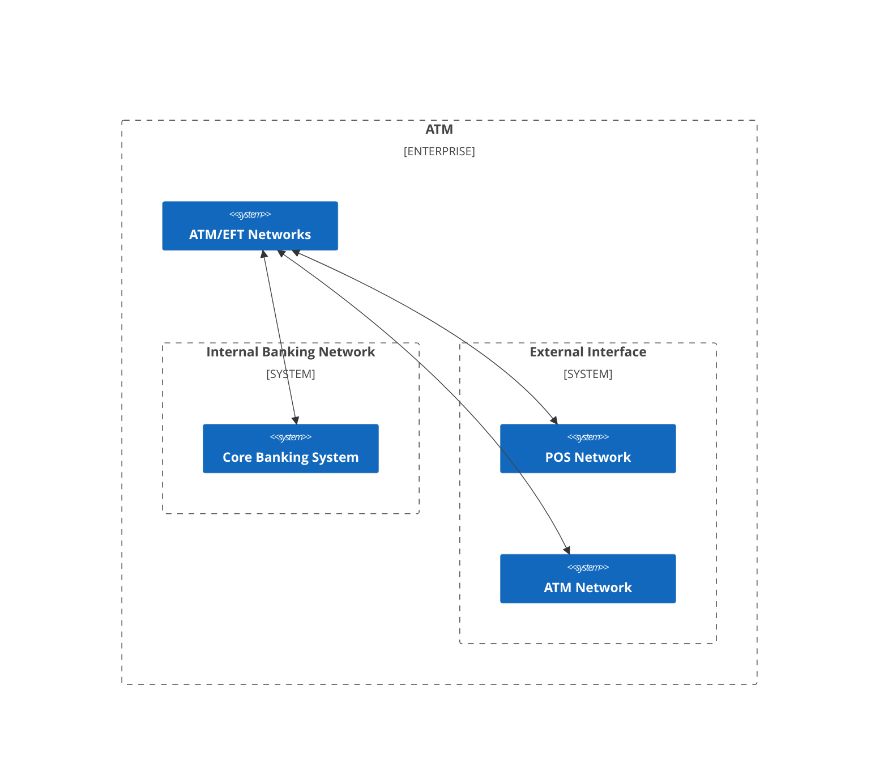

오랜만에 받는 외부 교육이라, 이곳에 수업내용을 정리해가려고한다.

## 1. Black/Gray/White Hacker

- Black Hacker: 범법적 해킹을 수행한다. 허가되었던 허가되지 않았던 해킹을 수행하며, 주로 취약점을 불법적인 경로로 사고팔거나, 몸값을 요구한다.

- Gray Hacker: 교묘하게 범법을 피해가며, 버그마운티와 같은 수단을 통해 해킹을 진행하고 보수를 받는다.

- White Hacker: 절대 범법적 해킹을 수행하지 않으며, 허가된 해킹만을 수행한다.

## 2. PENTEST : Penetration Test

PENTEST는 허용된 해킹으로,
자사의 보안 취약점을 알고싶어하는 회사가 해커에게 일부러 해킹을 허용하는 것으로,
해킹 과정에서 알아낸 취약점을 수정할 수 있다.

White Hacker는 이와 같이 제한된 방법으로만 해킹을 진행할 수 있다.

0. A회사는 자사의 보안 취약점을 알고싶어한다.
1. A회사는 해커 H에게 PENTEST를 의뢰한다.
2. 해커 H는 A회사의 보안을 뚫으려 시도한다.
3. 해커 H는 A회사에게 해킹 과정에서 알아낸 취약점을 A회사에게 제공한다.
4. A회사는 해당 취약점을 수정한다.

## 3. How to?

그래서 해킹은 어떻게 하는 걸까?

wargame같은 경우에는 문제에서 요구하는대로 flag만 털어오면 되고,
실전에서는 다음과 같은 과정을 거친다.

### Case: ATM Hacking

ATM을 털어달라는 고객의 요청이 들어왔다.
무엇부터 건드려보아야 할까?

1. 네트워크 기반으로 구축되어있으니, 패킷을 까보고 분석할 수 있다.
2. ATM기에 물리적인 백도어를 설치할 수 있다.
3. etc...

### Case: Car Hacking

자동차를 털어달라는 고객의 요청이 들어왔다.
무엇부터 건드려 보아야 할까?

1. 자동차 컴퓨터 유닛에 물리적인 백도어를 설치할 수 있다.
2. 자동차 키와의 통신을 분석할 수 있다.
3. etc...

## 4. 해킹의 자동화

"요즘 AI의 기세가 나날이 드세지는데,
해킹도 자동화할 수 있지 않을까?"
라고 생각한 사람들이 있었고, Cyber Grand Challenge라는 대회도 생겼다.
실적이 나쁘지만은 않다.
관심있는 사람들은 찾아보는 것도 나쁘지 않을 듯 하다.

## 5. 추천

1. webhacking.kr, pwnable.kr, reversing.kr 등 wargame 풀기
2. ***관심 분야 관련 논문 읽고, 컴퍼런스 참석하기 (중요!)***