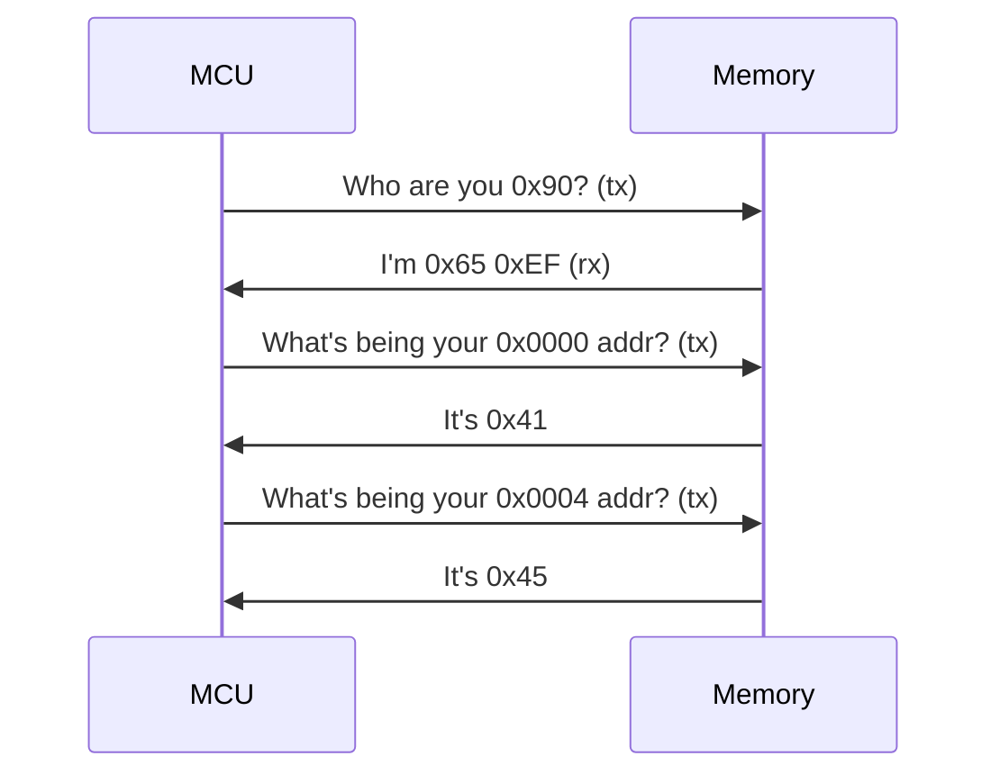

당신이 해커라면, 프로그램의 논리적 오류가 발생하는 곳을 통해 해킹을 할 수 있다고 생각할 수 있다.
그러나, 해커이기 이전에 개발자로써 생각해보자.

```c
int main()
{
    FILE *fp = fopen("./test", "r");
    fp = NULL;
    fscanf(fp, "test", 4);
    fclose(fp);
}
```

개발자라면, 이 코드에서의 버그를 발견했을 것이다.
`fp`가 `NULL`이기 때문에, fscanf에서 오류가 발생한다.
즉, 이것은 논리적 오류다.

그렇다면 이것은 마찬가지로 보안취약점일까?
만약 그렇다면, fscanf에 NULL을 넘겼을때의 오류이므로,
당신은 방금 libc의 취약점을 발견한 것이다.
뭔가 애매하다고 생각하지 않나?

다음의 사례를 살펴보자.

- Command injection: `stdin`으로 들어온 인자가 `system`함수로 들어가면서 실행되는 경우
- Memory corruption: 인자에 `NULL`이 들어와 crash나는 경우
- Hard Coded Key: 개인정보가 평문으로 저장된 경우
- DRM cracking: 루트 유저가 암호화된 영상이 복호화되는 드라이버를 조작하여 영상을 훔쳐낸 경우
- Device system modification: 디바이스와 펌웨어를 수정한 뒤 다시 칩에 fusing하여 루트 권한을 얻은 경우

전부 취약점 같지만, 정보의 중요도나 기타 까닭들로 허용될 수도 있는 것들이다.
물론 이것들을 해킹의 기점으로 삼을 수 있고, 우리는 이것을 attack surface라고 부른다.

단순하게 말하자면, attack surface는 해킹 시도가 가능한 지점을 말한다고 할 수 있겠다.

## Cases

### 스마트 자동차

- 스마트 폰과의 통신
- 카메라 & 센서
- TCU/ECU
- TPMS
- ADAS
- OBD-II
- Telematics
- Radio Data System

### 스마트 홈

- 도어락
- 로비도어
- 엘레베이터
- 가스밸브
- 조명/난방
- 차량개폐기
- 공용시설 제어 서버
- 동 gateway

## How to?

1. Firmware Extract
    - Flash memory dump
    - Binwalk
    - Unpacked
2. Static Analysis
    - IDA, GDB
    - System Device Discovering
    - Hardcode credential
    - System logic analysis
3. Dynamic Analysis
    - Emulating
    - Setting Debug environment
        - strace, gdb, lldb etc...
    - House, Frida etc...
4. Communication Analysis
    - TCP dump
    - TCP strip
    - Module analysis

## Case: Flash memory dump

대충 MCU와 메모리가 다음과 같이 소통한다고 생각해보자.



이 예제에서는 MCU와 메모리 사이의 소통이 오가는 전선의 납땜 부분이 attack surface다.

그럼, 간단하게 이 프로토콜에 맞게 내가 제작한 MCU에 메모리를 납땜으로 연결하고 위와 같은 프로토콜로 소통하여 flash memory의 덤프를 내올 수 있다.

## Case: Netflix

Netflix의 영상은 DRM이 걸려있어, 마음대로 녹화하지 못한다.
하지만, 모든 영상은 재생되고, 재생된다는 말은, 모니터에 특정한 프로토콜로 정보를 전송한다는 말이다.

즉, 여기서 attack surface는 모니터와 프로세서의 소통이고, 모니터로 가는 전선에 납땜해서 신호를 가로채오면 Netflix의 영상을 따올 수 있다.
