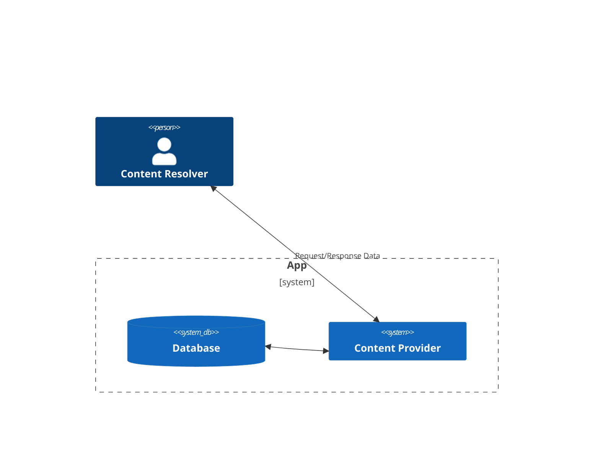

# Requisites for Android Developerment
- Android Studio
- JSK
- GenyMotion

# 안드로이드 앱의 4대 요소

* https://developer.android.com/guide/components/fundamentals.html

- Activity
- Service
- Broadcase receiver
- Content Provider

# Activity

- 앱의 화면을 담당하는 구성요소, 앱을 실해ㅇ시켰을때 우리 눈에 보이는 그 화면
- 중요한 점: 액티비티는 화면에 보이지 않을때에는 실행되지 않는 것이 원칙
- 그럼 화면에 보이지 않을 때도 뭔가 계속 실행되게 하고 싶으면 어떡함?

# Service

- 윈도우의 서비스, 리눅스의 데몬과 비슷한 개념
- 액티비티의 실행여부와 상관없이 백그라운드에서 작동하는 구성요소
- 음악플레이어, 화면에 재생화면이 뜨지 않고 카톡을 해도 노래는 재생되어야 함

# Broadcast Receiver

- 브로드캐스트를 수신하는 역할
- 안드로이드 시스템에서 이벤트가 발생하면 앱들에세 방송을 함
- 브로드캐스트 수신기 == 시스템에서 온 방송을 듣고 뭔가를 수행하는 역할
- 부팅이 완료됨, 화면이 켜짐, 화면이 꺼짐, 전화가 옴, 문자가 옴, 전화를 검 등등

# Content Provider

- 앱이 저장한 데이터를 다른 앱이 사용할 수 있도록 제공
- 연락처, 캘린더, 미디어파일 등

# APK

안드로이드 앱은 APK라는 확장자를 가진다.
APK는 zip포멧을 따르며, zip 유틸로 압축해제할 수 있다.

- AndroidManifest.xml
    - 루트 디렉터리에 위치하며, 앱에 대한 필수 정보를 담고 있음
- META_INF
    - 인증서 파일이 위치함
- classes.dex
    - 기본적으로 앱이 동작할 때 필요한 실행코드를 담고 있음
- lib/
    - 네이티브 라이브러리가 위치함, CPU 종류에 따라 armeabi, mips 등의 이름을 가짐
- asset/, resources/:
    - 앱에 필요한 그외의 파일들이 위치함
    - 악의적인 dex를 숨겨놓는 용도로도 쓰임

# Dalvik & Smali

- 초창기 안드로이드앱은 자바로 만들어졌다
- 일반적으로 Java로 만들어진 프로그램은 JVM을 통해 실행된다
- 안드로이드에서는 java로 프로그래밍하고 컴파일하게 되면 Dex 바이트코드 형태로 만들어지고, DVM(Dalvik Virtual Machine)위에서 동작한다
- JVM 라이센스 문제 때문에 구글에서 별도로 DVM을 개발하여 사용한다
- 안드로이드 롤리팝(5.0)부터는 새로운 런타임 환경인 ART(Android RunTime)이 사용된다

- Developers

Java (or Kotlin) -> DEX bytecode

- Hacker

DEX bytecode -> SMALI -> Decompiled.java

* Smali 코드: Human-Readable한 Dalvik 바이트코드

# Android Application Entry Points

- Launcher Activity:
    - 앱 아이콘을 클릭할 때 동작함 
    - AndroidManifest.xml에 정의되어 있다.
- Services
    - 액티비티의 싱행여부와 상관없이 백그라운드에서 작동하는 구성요소
    - 기본적으로 startService API를 호출해서 서비스를 시작하고
    - onStart, onStartCommand메소드를 이용해 서비스를 실행한다
- Broadcast Receivers
    - 특정 Broadcast가 시스템에서 발생했을때 그것을 처리해주는 역할
    - 2가지 방법으로 등록 가능
        - AndroidManifest.cml
        - registerReceiver API
    - 특정 Broadcase가 수신되면 onReceiver메소드를 실행
-  Exported Components (Services/Activities)
    - 앱 간 상호작용을 위해 외부에서 호출할 수 있는 구성요소
    - Android Manifest.xml에서 확인 가능
    - e.g. A앱의 로그인 기능중 xxx로 로그인하기 누르면 해당 앱이 실행되어 인증
- Application subclass

# How to?

- sstatic, dynamic analysis
- dex2jar jd-gui etc...
- Manifest; AndroidManifest.xml 분석
    - 앱에 대한 필수적인 정보들을 담고있는 파일
    - permission, package, application등 정의
