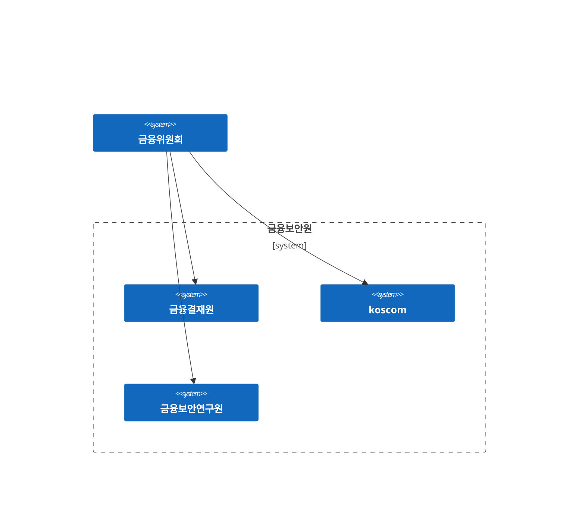

## 금융 보안

### 업계분위기

- 느리다.
    - 게임 & 인터넷 사업 군 대비 최신기술 적용 느림
- 앞장서서 변화하지 않음
- 잘 되어 있음
- 하라면 한다, 서비스보다는 보안이 우선
- 모든 일에는 근거가 필요

### 금융 ISAC

- ISAC: 정보 공유 분석 센터
- 해킹이나 사이버 테러 취약점과 침해요인, 대응 방안에 관한 정보를 가입 기관에 제공하고 침해사고가 발생했을 때 실시간으로 정보와 분석업무를 처리하는 업무를 수행

본래 금융결재원 은행 ISAC, koscom 증권 ISAC, 금융보안연구원으로 나뉘어져 있었으나,
금융위원회 주도로 2015년 4월 10일에 금융보안원이라는 이름으로 통합되어 출범하였다.

### 금융보안원

- 취약점 분석평가
- 최신보안 정보제공
- 전문 보안교육
- 통합 보안관제
- RegTech(Regulatory Technology): 은행의 리스크 관리 기능을 보다 효율적으로 향상시켜주는 것

## 보안 컨설팅

보안컨설팅: 정보통신시설 및 시스템을 안전하게 유지하기 위하여 보호대책 수립, 위험요인 평가, 모의해킹, 마스터플랜 수립 등을 수행하는 일련의 과정을 말한다

### What?

- 취약성 진단 컨설팅
    - 시스템/네트워크 취약성 테스트
    - 취약성 결과 보고 및 대안 제시
- 기본 보안 컨설팅
    - 보안 체크리스트 이용-기본적인 정보보호수준점검
    - 보안절차 및 대책 권고 (취약성 진단 컨설팅 포함)
- 주요 정보통신 기반시설 정보보호 컨설팅
    - 금융감족위원회/정보통신부 취약점 준석 평가 기준을 반영한 보호 대책 
- 정보보호 안전진단 심사
- 종합 보안 컨설팅
- 개인정보 보호 컨설팅
- 시스템개발단계보안컨설팅
- 인증체계 유지 시스템
- 보안 감사

직업으로는...

- 기업 정보보안 담당자
- 정보보호 컨설턴트
- 각종 보안 솔루션 개방자
- 각종 보안 솔루션 운영자, 기술 영업
- 리스크 관리 담당자
- 전산 감사 담당자
- 개인정보보호 담당자
- 침해사고 분석 & 대응
- 취약점 분석가
- 보안 관제

### Why?

- 전자금융거래법
- 전자서명법
- 전자거래기본법
- 자본시장과 금융투자업에 관한 법률
- 주식회사의 외부감사에 관한 법률
- 정보통신망 이용촉진 및 정보보호에 관한 법률
- 신용정보의 이용 및 보호에 관한 법률
- 금융실명제 및 비밀보장에 관한 법률
- 전자상거래 등에서늬 소비자 보호에 관한 법률
- 장애인 차별 금지 및 권리 규제에 관한 법률
- 전자정부법
- 정보시스템의 효율적인 도입 및 윤영등에 대한 법률
- 기타 등등...

### If not?

- 금융기업들이 보안컨설팅을 받지 않는 경우, 전자금융거래법에 따라 보안컨설팅을 받지 않았다는 사실을 홈페이지에 고지해야하며, 과태료가 부과된다
- 또한, 정보기술부문 인력 및 정보보호인력을 총 임직원 수에 대해 일정 비율 이상 고용해야한다

(단, 취약점 분석 평가는 **총자산이 2조원 이상**이고, 상시 종업원 수가 300명 이상인 금융회사들만 실시한다.)

## 정보보호 인프라

1. 이용자
2. 금융 ISAC 보안관제 영역
    a. 통신장비
    b. 침입감지 시스템
3. 금융 회사 자체 보안 관제 영역
    a. DMZ
        I. 1차 침입차단 시스템
        II. 인터넷 뱅킹 웹 서버
        III. 2차 칩입차단 시스템
    b. 내부망
        I. 업무용 AP 서버
        II. 고객 DB 서버
        III. 계정계 시스템

### DDos 차단 시스템

1. 침입방지 (IPS)
2. 방화벽
    - 침입방지(IDS)
        - 내부네트워크
    - DMZ
        - 웹방화벽(WAF) -> Web서버
        - 스팸차단 -> Mail서버

### DDos차단 시스템

1. 자원(PPS) 소모성 공격: Syn Flooding, TCP Connection Flooding, TCP out-of-state Packet Flooding Attack
2. 웹 서비스 지연 공격: 동일 URL 반복 접속, 로그인 반복 시도
3. 대용량 트레픽 전송 공격: UDP/ICMP Flooding Attack

### 웹방화벽(WAF)

1. 웹셸
    - 공격자가 원격에서 대상 웹서버에 명령을 수행할 수 있고록 작성한 웹 스크립트 파일(.asp, .jsp, .php)
2. 위험성
    - 루트 권한 탈취
    - 서버 내 자료 유출
    - 백도어 설치

### 스팸메일 탐지 시스템

1. 메일서버에서 발송
2. DLP(mta1,mta2)로 forwarding(정보유출 확인)
3. 최종 목적지 메일 주소로 발송

### 허니팟

*Honey Pot*: 비정상적인 접근을 탐지하기 위해 의도적으로 설치해 둥 시스템, 네트워크 상에 특정 서버를 연결해 두고 해당 서버에 중요한 정보가 있는 것처럼 꾸며두면 공격자가 해당 서버를 크래킹하기 위해 시도하는 것을 탐지하기 위함

### 무선 보안

1. 무선구간 서비스 거부 공격
2. 모바일 악성 트레픽 통로
3. 비인가 불법 AP 접속 유도
4. 정보 유출

따라서, 네트워크 기반시설에서는 무선 신호가 허용되지 않는다.

### 트래픽 분석기

SNMP 성능 모니터링 분석
네트워크 상황 분석 FetFlow
네트워크 흐름 분석
네트워크 데이터 접근
