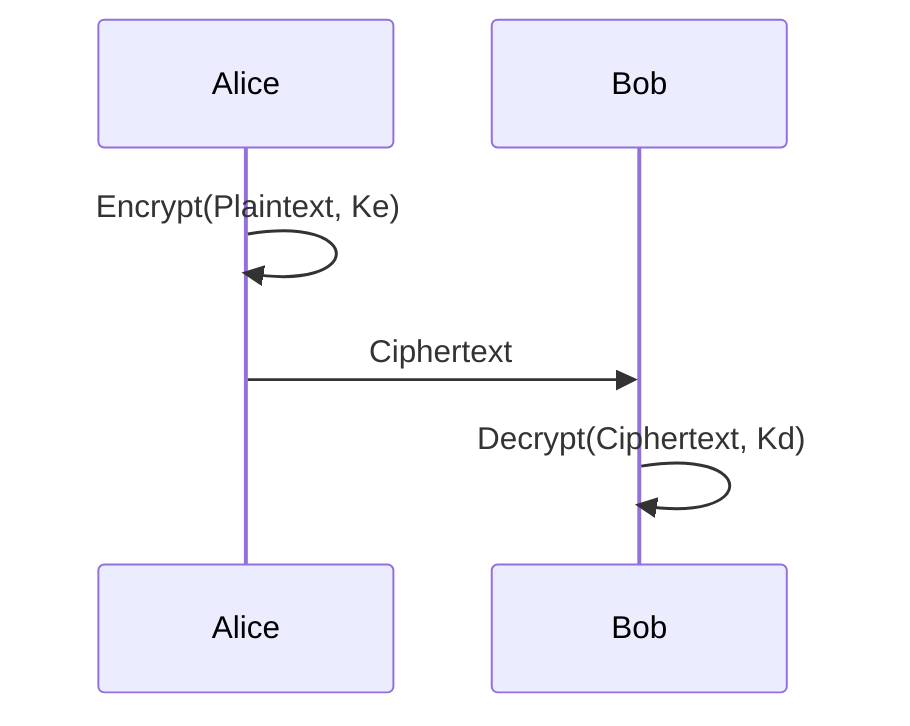

## Cryptology

- Cryptography: 암호화
    - plaintext를 보호하기 위한 암호화 알고리즘을 연구
- Cryptanalysis: 암호해독
    - ciphertext을 해독하기 위해 암호화 과정과 암호문을 연구

## Encrypted Communication

- Eve: 도청꾼
- Mallory: 지나가는 정보를 조작하는 사람



- $K_e$: 암호화키
- $K_d$: 복호화키

## History of Cipher

*By hand*

- BC100: Carsar
- 1500~: Vigenere

**World War**

*By machine (gears)*

- 1918: Enigma
- 1930~: War
    - JAP: PURPLE
    - GER: Lorenz
    - UK: Typex

**Invention of Computer**

*By machine (semiconductor)*

- 1960~: Complex Computation
    - RSA
    - RES
    - AES
    - ECC

**Invention of Quantum Computer**

*By machine (superconductor?)*

- Future: Post Quantum
    - PQC(Post Quantum Cryptography) -> 양자 내성 암호

## 고전 암호

### Scytale 암호

- Purmutation(치환)/Trans-position(자리바꿈) 암호화
- 암복호화 키: 막대의 지름

Plain Text: I am hurt very badly help

   |   |   |   |
:-:|:-:|:-:|:-:|:-:
 I | A | M | H | U
 R | T | V | E | R
 Y | B | A | D | L
 Y | H | E | L | P

Cipher Text: IRYYATBHMVAEHEDLURLP

### Caesar 암호

- Substitution(대치) 암호화
- 암복호화 키: (알파벳이 이동한) 고정된 숫자

 A | B | C | D | E | F | G
:-:|:-:|:-:|:-:|:-:|:-:|:-:
 E | F | G | H | I | J | K

### 공격

Monoalphabetic cipher(하나의 문자가 하나의 문자로 대치)이므로, 빈도 분석을 통해 암호화를 깰 수 있음

## 근대 암호

### Vigenere 암호

Polyalphabetic cipher: 하나의 문자가 여러개의 문자로 대치(빈도분석이 불가)

 a | t | t | a | c | k | i | n | g | t | o | n | i | g | h | t |   |   |   |   |   |
:-:|:-:|:-:|:-:|:-:|:-:|:-:|:-:|:-:|:-:|:-:|:-:|:-:|:-:|:-:|:-:|:-:|:-:|:-:|:-:|:-:|
 O | C | U | L | O | R | H | I | N | O | L | A | R | I | N | G | O | L | O | G | Y |

## 현대 암호

### Shannon Entropy

확률변수 $X: P -> E$가 분포 $f: E -> R$를 따르며, 표본 공간 $E = {x_1, ..., x_n}$가 이산 공간일때, 정보 엔트로피는 다음과 같다.

$$
H(X) = -\sum_{i}^{} f_i \log_2 f_i
$$

e.g.) $n$비트 이전 스트링으로 이뤄진 시스템의 엔트로피

$$
H(X) = -\sum (\dfrac{1}{2^{n}}) \log_2 (\dfrac{1}{2^{n}}) = n
$$

=> 가능한 정보들을 인코딩 하기 위한 평균 비트 수

- **Perfect Secrecy**: $Pr(M|C) = PR(M) \rightarrow \textit{\textbf{Possible?}}$
    - Perfect Secrecy를 위해서는, plaintext가 1GiB일때, key또한 1GiB여야 한다.

### One-Time-Pad (Vernam Cipher)

- $PT$: midnight => 01101101 01101001 01100100 01101110 01101001 01100111 01101000 01110100
- $Key$: \[rand,\] => 01100110 01110010 01100001 01100011 01110100 01101001 01101111 01101110

 PT | 01101101 | 01101001 | 01100100 | 01101110 | 01101001 | 01100111 | 01101000 | 01110100
---:|:--------:|:--------:|:--------:|:--------:|:--------:|:--------:|:--------:|:--------:
Key | 01100110 | 01110010 | 01100001 | 01100011 | 01110100 | 01101001 | 01101111 | 01101110
 CT | 00001011 | 

- $len(Key) = len(PT)$, 키 재사용 금지, 난수 생성의 어려움
- VERONA Project: NSA가 KGB의 Vernam cipher키를 재사용하는 약점을 이용해 공격

### Alternative

- Confusion(혼돈): 평문과 암호문 사이의 관계가 알려지지 않게 함
- Diffusion(확산): 평문의 변화가 암호문에 잘 확산되도록 함

```mermaid
flowchart LR
    x>"X"] 
    d0["Diffusion 0"]
    c0["Confusion 0"]
    d1["Diffusion 1"]
    c1["Confusion 1"]
    dn["Diffusion N"]
    cn["Confusion N"]
    y>"Y"]

    x --> d0
    d0 --> c0
    c0 --> d1
    d1 --> c1
    c1 -. ... .-> dn
    dn --> cn
    cn --> y 
```

### 메시지 암/복호화


- 모두가 나에게 메시지를 보낼 수 있다
- 메시지의 내용은 나만 알 수 있다

### 전자 서명


- 나만 메시지를 보낼 수 있다
- 모두가 메시지의 내용을 볼 수 있다

### Cryptographic Hash Function

- 해시함수: 임의 길의의 데이터를 고정 길이의 데이터로 매핑하는 함수
- 암호학적 해시함수: 해시 값이 입력값의 특성을 최대한 반영하도록 설계됨
    - 역상 저항성(Preimage Resistance): 해시 값을 통해 평문을 알기 힘들어야 한다
    - 제 2 역상 저항성(Sencondary Preimage Resistance): 입력 A의 해시값과 충돌하는 해시값을 가지는 입력 B를 찾기 어려워야 한다
    - 충돌 저항성(Collision Resistance): 입력 A의 해시값과 입력 B의 해시값이 충돌하기 어려워야 한다

## 암호의 특성

- 기밀성
- 무결성
- 인증
- 부인방지